Check out the configuration reference at https://huggingface.co/docs/hub/spaces-config-reference

# Gradio App User Guide

This is my Gradio App homework assignment User Guide.  The beginning of this markdown file is of the Huggingface generated part, where it says title, emoji, sdk, etc...  I am not sure if that is referenced or needed actually, but I left it in the file, as what is apparently configuration information related to the link it generated.

Here is a link to the video demo: 

https://drive.google.com/file/d/1DoMj5CAfjCgOVVMpDqr8VTJCULrFw-4c/view?usp=share_link

Here is a link to the Hugging Face space:

https://huggingface.co/spaces/RyanS974/525GradioApp

# Introduction

This is a Gradio app that allows you to compare the responses of two different LLMs (Language Models) to the same input prompt. The app provides a simple interface where you can enter a prompt and responses yourself, or select from the built-in dataset. The app is built using the Gradio library, which provides a user-friendly interface for creating web applications with Python. The app is designed to be easy to use and provides a simple way to compare the responses of different LLMs to the same input prompt. It can be useful for researchers and developers who want to evaluate the performance of different LLMs on the same task.

There are three main tabs:

- Dataset Input
- Analysis (four options, including a classifier that is NLTK VADER based)
- RoBERTa Sentiment (Transformer based classifier)
- Summary
- Visuals (this is a basic graphing display that is hard-coded, not dynamic based on the datasets)

I will quote the assignment prompt and make a few comments:

"You might think about it as a mini hackathon over the course of several weeks instead of a single day, aiming to build an engaging proof-of-concept demo of an idea you have – you are not expected to have a fully, production-ready application for this assignment."

The app is fairly stable and has a decent amount of features, although it is not a fully production-ready application.  I believe with more time I could refine this, but a good amount of time was put into it to get it to an acceptable state for the assignment requirements.  One of the things is I would recommend restarting the space if you want to load another dataset and have the results built through the analysis options and displayed in the summary tab for you to send to an LLM if you want.  The visuals tab is more of an example of some hard-coded results, with the n-grams option of the anlysis tab having the dynamic graphing.  That option will display graphs based on the dataset, including a created dataset.  I could have added more graphs to other options, including the RoBERTa classifier, but felt the current state is of acceptable features.

# Usage

Here is a brief usage guide with screenshots.  I do not go into much detail here, with that saved for the documentation section.

## Intro

I will start with a few troubleshooting tips.

Below shows the top menu of a Hugging Face space.  If you click the button to the right of the 'Running' button in green, it will show the debug log.  There are two tabs on this also, the build tab and the container tab, with the container tab showing more information.

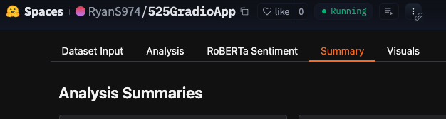

Here is the debug log, specifically the container tab.  This is of the RoBERTa classifier running.

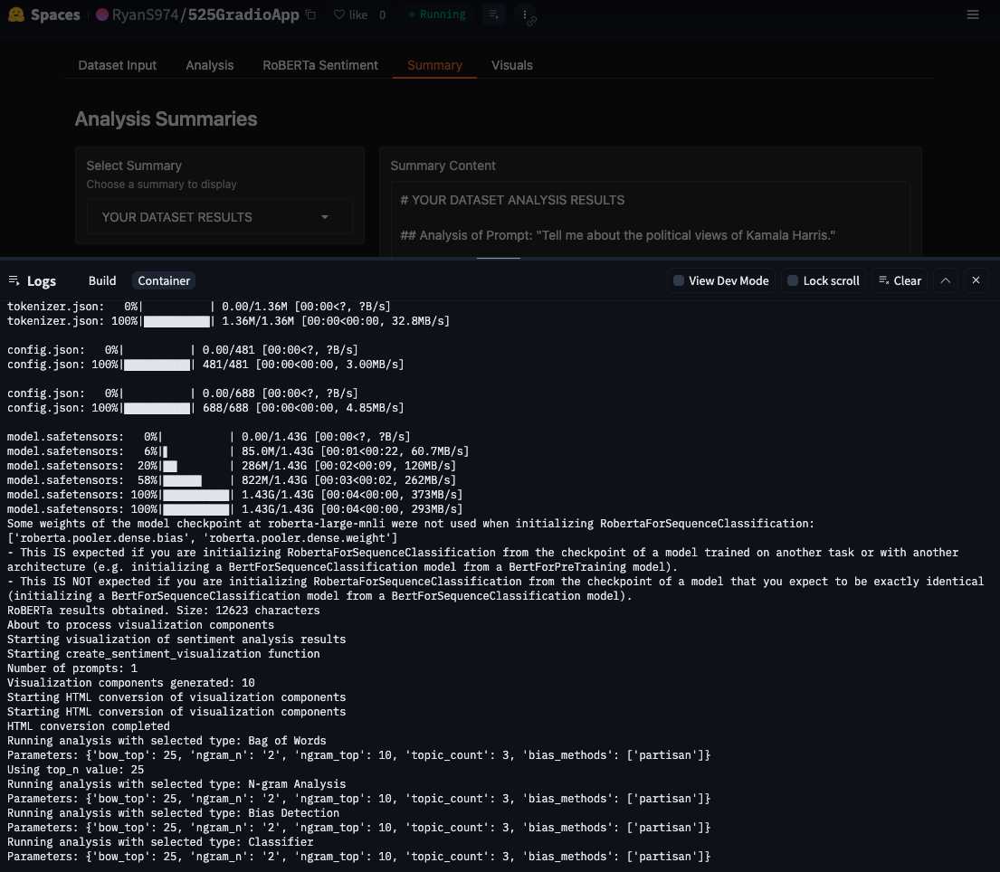

If you have problems, you can try restarting the space.  Click the button the right of that debug log button spoken of above, and it will bring up this menu.  Click restart space to restart the space.  If you load a new dataset ever, it is recommended to do this, as there might be issues with the analysis logging displayed in the summary tab, which appends results unless it is the same analysis option.

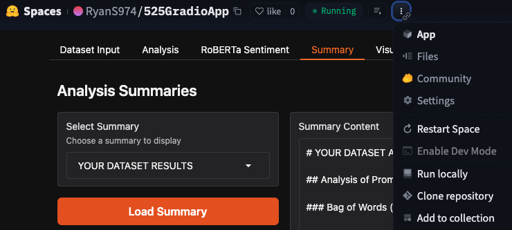

## Dataset Input

The dataset input tab allows you to select a dataset from the built-in dataset or enter your own prompt and responses. You can select a dataset from the dropdown menu, or enter your own prompt and responses in the text boxes.  The load dataset button will fill in the text boxes with the selected dataset.  With that or your own dataset, you then click the create dataset button and a message will display below that stating if it was successfully created.  Now click on the Analysis tab.

The built-in datasets are:
- person-harris.txt: Responses about Kamala Harris
- person-trump.txt: Responses about Donald Trump
- topic-foreign_policy.txt: Responses about foreign policy views
- topic-the_economy.txt: Responses about economic views

There are two responses each, one from LG's ExaOne 3.5, and the other from IBM's Granite 3.2.  These are both approximately 5gb models that are Ollama compatible, which is how the results were obtained.

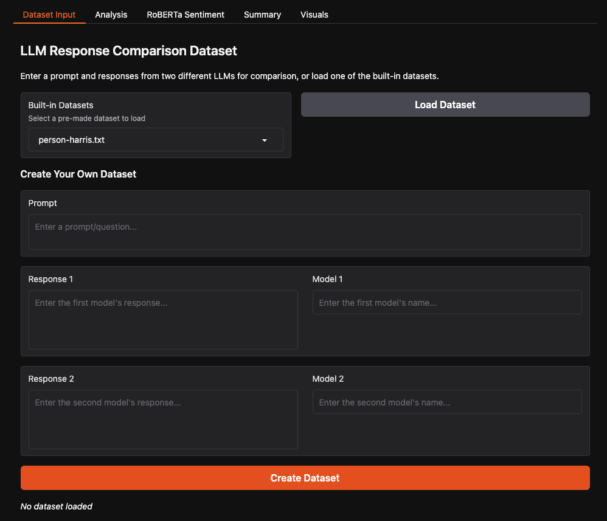

## Analysis

Once you have loaded a dataset, you now have four options:

- Bag of Words
- N-grams
- Bias Detection
- Classifier

The N-grams option will produce a dynamic graph.  Also, these options will product a text file with the results that can be accessed in the summary tab.  If you go through all four of these analysis options it will append them to the file.

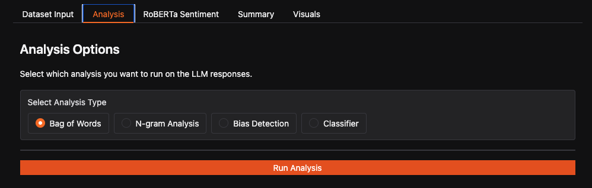

### Bag of Words

Bag of Words here is fairly basic.  There are no parameter options.  Click run analysis and you will see some comparison results.

Similarity Metrics Terms:

- Cosine Similarity: Measures the cosine of the angle between two non-zero vectors.  A value of 1 means they are identical, while a value of 0 means they are orthogonal.
- Jaccard Similarity: Measures the similarity between two sets.  A value of 1 means they are identical, while a value of 0 means they have no overlap.
- Semantic Similarity: Measures the similarity between two texts based on their meaning.  A value of 1 means they are identical, while a value of 0 means they have no similarity.
- Common Words: The number of words that appear in both responses.

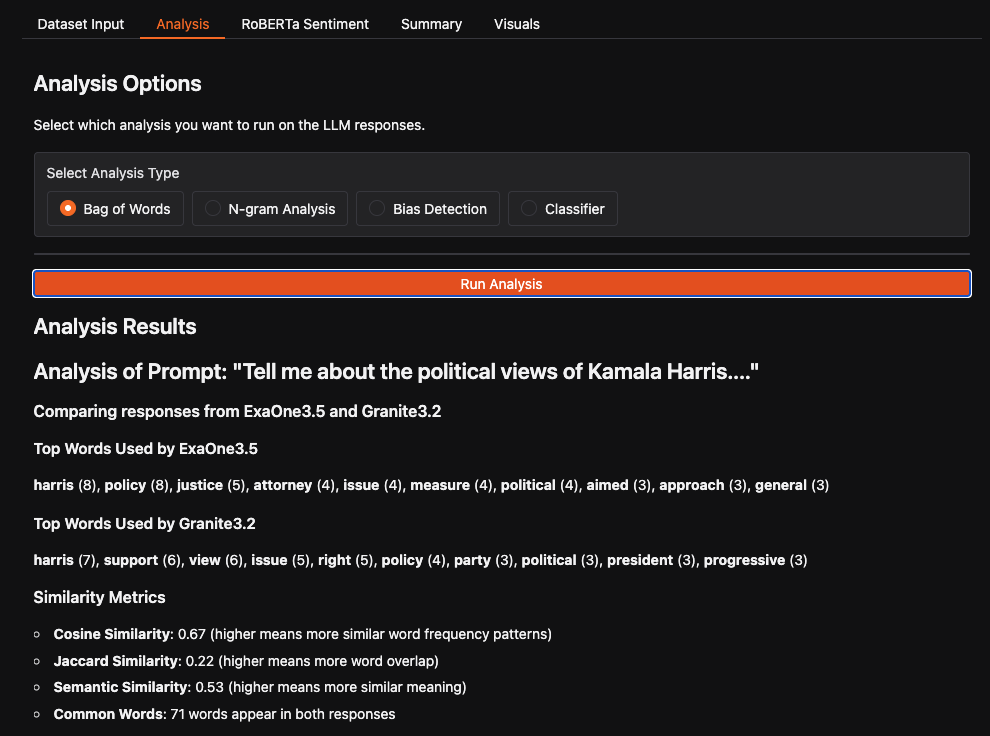

### N-grams

There are three options here, which are of 1, 2 or 3-grams.  Default is 2.  Click the button below that and it will generate the results, including a chart.

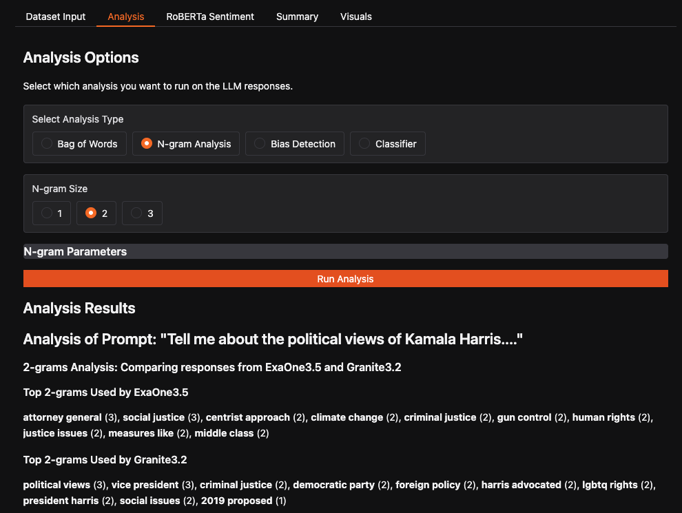

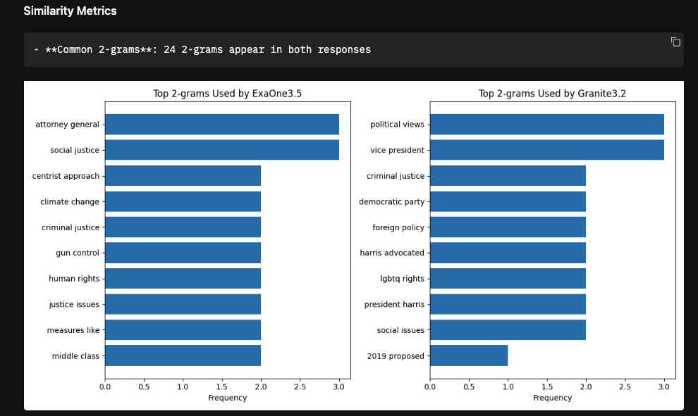

### Bias Detection

Bias detection has no options.  Just click the button and it will generate the results.  The details of this are covered in the documentation section later.

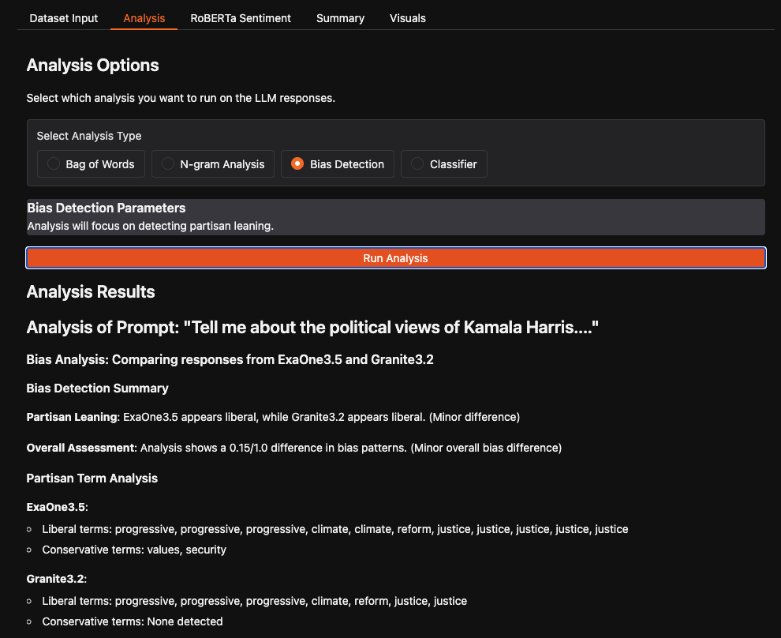

### Classifier

This classifier is a NLTK VADER based classifier.  It will classify the responses as positive, negative or neutral.  It will also classify the formality, sentiment and complexity of the responses.  The complexity is based on the Flesch-Kincaid readability test.  The results are displayed after clicking the button.

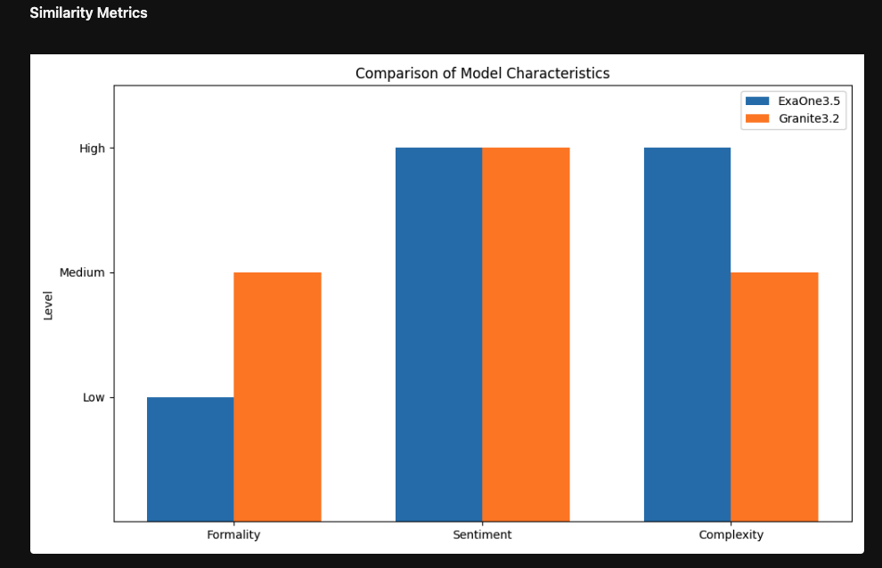

## RoBERTa Sentiment

The RoBERTa sentiment analysis classifier will output which model is more positive, negative, or neutral.  It will give a score also, as is depicted in the screenshot below.  There are no options on this, just click the button and it will display the results.  This takes approximately 45 seconds for the built-in datasets, so you will have to give it a little bit of time.

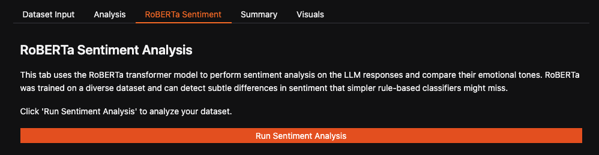

The results are shown below.

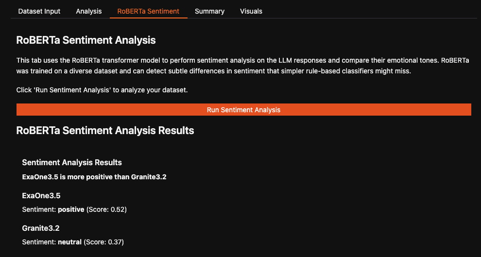

## Summary

The summary tab provides a summary of two of the prompts: the Trump and Harris prompts.  This is hard-coded in the app.  It is text files selectable from a dropdown menu.  The first part of the prompt is the summary from an LLM.  One is from Claude 3.7 and the other ChatGPT o4.  The second part of the text file, below the first, is the actual data given to the LLM, which is of the results from the various analysis options.  A user could copy and paste these in an LLM to get a similar response from their user entered datasets.

The left has an example prompt to send to the LLM.  You would copy and past that first, giving the LLM instructions on what the proceding text is, which is the results in the right text box, which you want to copy and paste into the LLM.  There are two build-in responses in that drop down list box.  One from Harris, and the from Trump.  I think it is very interesting seeing the views and interpretations by ChatGPT and Claude on this.  It helps distinguish the two models.  

I mention elsewhere here in this guide that there are various reasons I did not implement an LLM in the app, which I believe was a good choice given the situation.  Copying and pasting the data over to an LLM of your choice is a simple process also. 

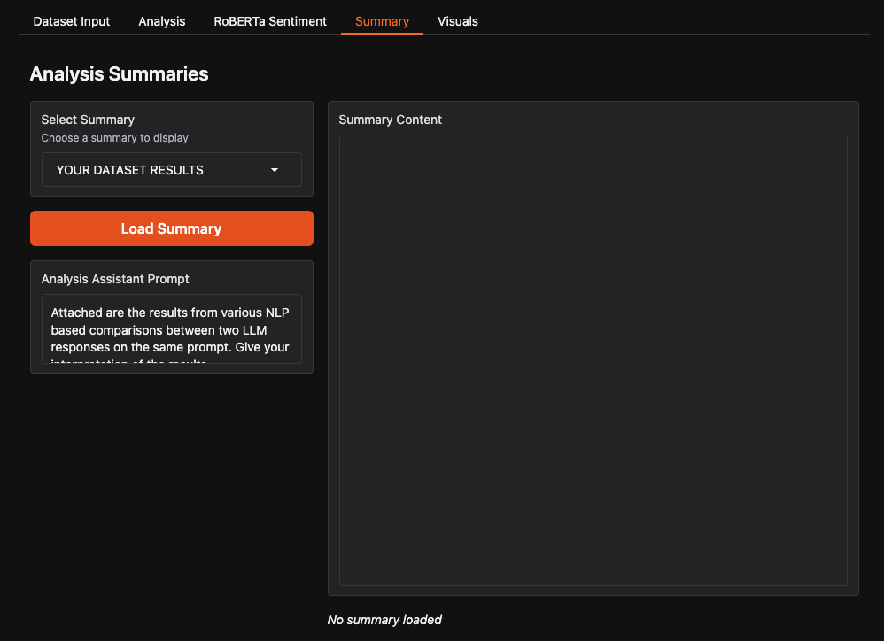

Below is the summary area filled in after clicking the button with the YOUR DATASET RESULTS selected.

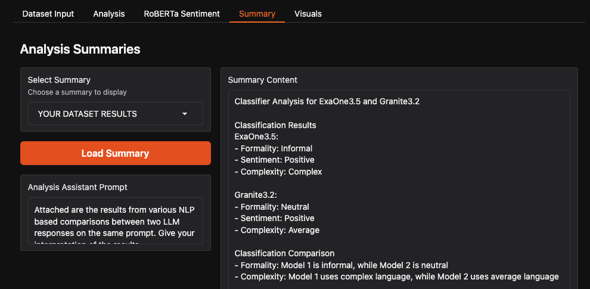

IMPORTANT NOTE: If you want to use another dataset, and create it, you need to restart the space first.  Currently, the summary tab with the appended results does not clear out automatically.  This is a basic addition that in retrospect I should have added.  I will most likely add it, so when you test the app it might aleady be there.  If not, just restart the space to work with another dataset.  

## Visuals

This is a hard-coded tab that displays some basic graphs.  The first one is a bar chart of the top words used by each model. This is more for example purposes.  It is not dynamic like the other two, which are for n-grams and the VADER classifier.  Those dynamically generate charts based on the dataset, whether a built-in one or user entered.

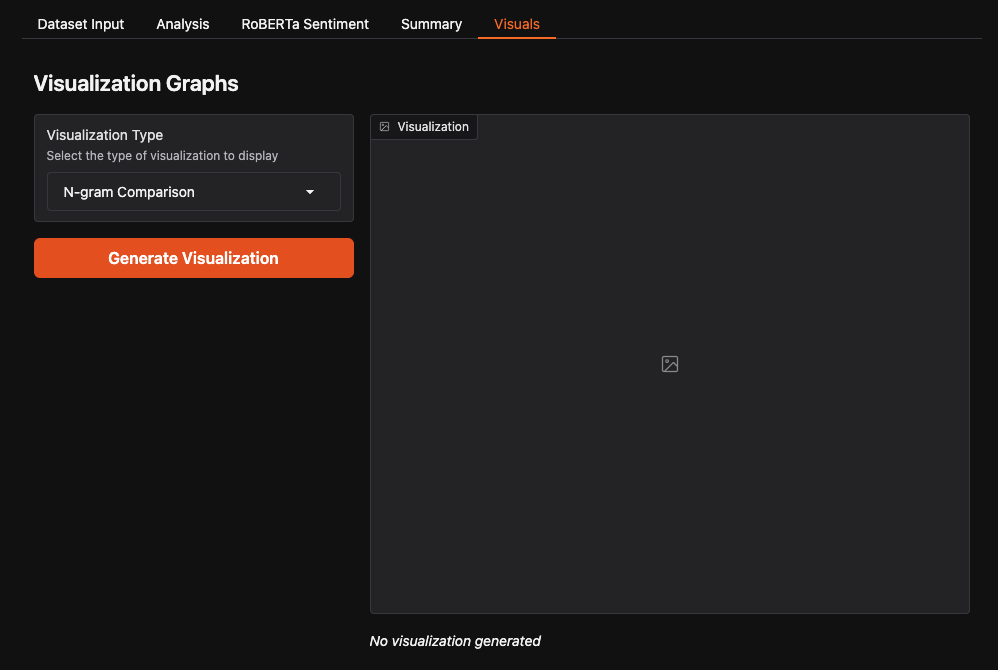

Below is the chart.

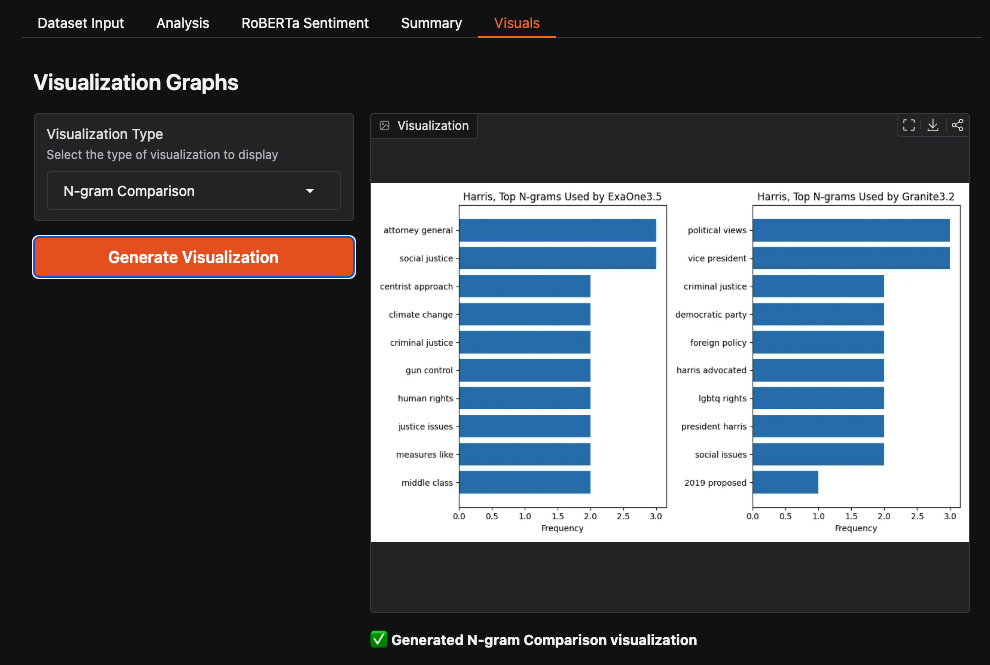

# Documentation

Here is the more in-depth and technical documentation of the app.

## Datasets

Built-in Dataset Structure

The application includes several pre-built datasets for analysis:

Format: Simple text files with structured format:
\prompt= [prompt text]
\response1= [first model response]
\model1= [first model name]
\response2= [second model response]
\model2= [second model name]

Included Datasets:

Political Figures Responses: Comparisons of how different LLMs discuss political figures

- person-harris.txt: Responses about Kamala Harris
- person-trump.txt: Responses about Donald Trump

Political Topics Responses: Comparisons on general political topics

- topic-foreign_policy.txt: Responses about foreign policy views
- topic-the_economy.txt: Responses about economic views

Dataset Collection Process:

- Prompts were designed to elicit substantive responses on political topics
- Identical prompts were submitted to different commercial LLMs
- Responses were collected verbatim without modification
- Model identifiers were preserved for attribution
- Responses were formatted into the standardized text format

Dataset Size and Characteristics:

- Each dataset contains one prompt and two model responses
- Response length ranges from approximately 300-600 words
- Models represented include ExaOne3.5, Granite3.2, and others
- Topics were selected to span typical political discussion areas

## Frameworks

- Gradio is the main framework used to build the app.  It provides a simple interface for creating web applications with Python.
- Matplotlib is used for some basic plotting in the visuals tab.
- NLTK is used mainly for the VADER sentiment analysis classifier.
 - This is for both the basic classifier and bias detection.
- Hugging Face Transformers is used for the RoBERTa transformer model.
- Scikit-learn is used for the Bag of Words and N-grams analysis.
- NumPy is used for numerical computations.
- JSON and os are used for file handling in relation to the datasets.
- re, Regular Expressions, is used for text processing and cleaning.

## App Flow

We start with the dataset input.  This can be a user entered dataset or a built-in dataset.  We then go to the analysis tab which has four options.  After that is a RoBERTa classifier, which is a transformer model compared to a non-transformer classifier used in the analysis tab.  We have a summary after that, followed by some basic visual plots.  From the summary tab you can feed that, and the example prompt, into an LLM to get a summary of the results.

## Bag of Words

Basic preprocessing is done to the text data, including:

Initialization of NLP tools:

- Loads English stopwords from NLTK
- Creates a WordNet lemmatizer object

Text processing pipeline (applied to each input text):

- Case normalization: Converts all text to lowercase
- Tokenization: Splits text into individual words/tokens using NLTK's word_tokenize
- Filtering: For each token, applies these criteria:
  - Must contain only alphabetic characters
  - Must not be a stopword (token not in stop_words)
  - Must be longer than 2 characters
- Lemmatization: Converts each filtered token to its base/root form using WordNet lemmatizer
- Reconstruction: Joins the filtered and lemmatized tokens back into a space-separated string

Vectorization:

- Uses CountVectorizer from scikit-learn with max_features=1000 to convert the preprocessed texts into a bag-of-words representation
- This creates a sparse matrix where each row corresponds to a document and each column to a unique word in the corpus

Here is an example of the results from the Harris text file:

Top Words Used by ExaOne3.5

harris (8), policy (8), justice (5), attorney (4), issue (4), measure (4), political (4), aimed (3), approach (3), general (3)

Top Words Used by Granite3.2

harris (7), support (6), view (6), issue (5), right (5), policy (4), party (3), political (3), president (3), progressive (3)

Similarity Metrics

- Cosine Similarity: 0.67 (higher means more similar word frequency patterns)
- Jaccard Similarity: 0.22 (higher means more word overlap)
- Semantic Similarity: 0.53 (higher means more similar meaning)
- Common Words: 71 words appear in both responses

The main concepts here of comparison are the top words used by each model, the similarity metrics, and the common words.  The top words are the most frequently used words in each response.  The similarity metrics are calculated using cosine similarity, Jaccard similarity, and semantic similarity.  The common words are the words that appear in both responses.

## N-grams

The main modules used here are scikit-learn, NLTK, NumPy, and Collections.  We have options for 1, 2 and 3-grams.  The n-grams are generated using the n-grams function from scikit-learn.  The n-grams are then counted and displayed in a bar chart using Matplotlib.

## The Classifiers

There is a RoBERTa transformer based classifier and one that uses NLTK VADER sentiment analysis. The RoBERTa classifier is a transformer model that is trained on a large corpus of text data and is designed to understand the context and meaning of words in a sentence.  The NLTK VADER sentiment analysis classifier is a rule-based model that uses a lexicon of words and their associated sentiment scores to determine the sentiment of a sentence.  Both classifiers are used to analyze the sentiment of the responses from the LLMs.  The VADER one is simpler and faster, while the RoBERTa one is more complex and takes longer to run.  The RoBERTa classifier is also more accurate than the VADER classifier, but it requires more computational resources to run.

### RoBERTa

Architecture: RoBERTa (Robustly Optimized BERT Pretraining Approach) is a transformer-based language model that improves upon BERT through modifications to the pretraining process.

Training Procedure:

- Trained on a massive dataset of 160GB of text
- Uses dynamic masking pattern for masked language modeling
- Trained with larger batches and learning rates than BERT
- Eliminates BERT's next-sentence prediction objective

Implementation Details:

- Uses the transformers library from Hugging Face
- Specifically uses RobertaForSequenceClassification for sentiment analysis
- Model loaded: roberta-large-mnli for natural language inference tasks

Compute Requirements:

- Inference requires moderate GPU resources or CPU with sufficient memory
- Model size: ~355M parameters
- Typical memory usage: ~1.3GB when loaded

Training Data:

- BookCorpus (800M words)
- English Wikipedia (2,500M words)
- CC-News (63M articles, 76GB)
- OpenWebText (38GB)
- Stories (31GB)

Known Limitations:

- May struggle with highly domain-specific language
- Limited context window (512 tokens)
- Performance can degrade on very short texts
- Has potential biases from training data

### NLTK VADER

Components Used:

- NLTK's SentimentIntensityAnalyzer (VADER lexicon-based model)
- WordNet Lemmatizer
- Tokenizers (word, sentence)
- Stopword filters

Training Data:

- VADER sentiment analyzer was trained on social media content, movie reviews, and product reviews
- NLTK word tokenizers trained on standard English corpora

Limitations:

- Rule-based classifiers have lower accuracy than deep learning models
- Limited ability to understand context and nuance
- VADER sentiment analyzer works best on short social media-like texts

## Bias Detection

Sentiment Bias Detection (detect_sentiment_bias):

- Uses NLTK's SentimentIntensityAnalyzer to measure positive/negative sentiment
- Calculates bias direction (positive, negative, neutral) and strength (0-1)
- Based on compound sentiment score thresholds

Partisan Leaning Detection (detect_partisan_leaning):

- Identifies liberal vs. conservative language using predefined word lists
- Calculates a lean score from -1 (liberal) to +1 (conservative)
- Identifies specific partisan terms used in the text

Framing Bias Detection (detect_framing_bias):

- Analyzes how issues are framed across four dimensions:
 - Economic framing (economy, taxes, jobs, etc.)
 - Moral framing (values, ethics, faith, etc.)
 - Security framing (defense, protection, threats, etc.)
 - Social welfare framing (healthcare, education, benefits, etc.)
- Identifies the dominant frame and its strength

Comparative Analysis (compare_bias):

- Compares two texts across all three bias dimensions
- Calculates differences in sentiment, partisan leaning, and framing
- Determines whether differences are significant using predefined thresholds
- Provides an overall bias difference score

## Results

Here are results from the person-harris.txt dataset:

Prompt: "Tell me about the political views of Kamala Harris."

### Bag of Words Analysis

| Model           | Top Words Used                                                                                                                 |
|-----------------|--------------------------------------------------------------------------------------------------------------------------------|
| **ExaOne3.5**   | harris (8), policy (8), justice (5), attorney (4), issue (4), measure (4), political (4), aimed (3), approach (3), general (3) |
| **Granite3.2**  | harris (7), support (6), view (6), issue (5), right (5), policy (4), party (3), political (3), president (3), progressive (3)  |

| Metric                    | Value |
|---------------------------|-------|
| **Cosine Similarity**     | 0.67  |
| **Jaccard Similarity**    | 0.22  |
| **Semantic Similarity**   | 0.53  |
| **Common Words**          | 71    |

---

### Classifier Analysis

| Propert  y     | ExaOne3.5        | Granite3.2       |
|----------------|------------------|------------------|
| **Formality**  | Informal         | Neutral          |
| **Sentiment**  | Positive         | Positive         |
| **Complexity** | Complex          | Average          |

Comparison Summary:
- ExaOne3.5 is **more informal** and **more complex**
- Granite3.2 is **more neutral** in tone and **simpler**

---

### Bias Detection

| Model           | Partisan Leaning  | Liberal Terms                                                                      | Conservative Terms      |
|-----------------|-------------------|------------------------------------------------------------------------------------|-------------------------|
| **ExaOne3.5**   | Liberal           | progressive ×3, climate ×2, reform, justice ×5                                     | values, security        |
| **Granite3.2**  | Liberal           | progressive ×3, climate, reform, justice ×2                                        | *None detected*         |

| Bias Difference Score | 0.15 (Minor) |

---

### Sentiment Analysis (RoBERTa)

| Model        | Sentiment | Score    |
|--------------|-----------|----------|
| **ExaOne3.5**   | Positive  | 0.52  |
| **Granite3.2**  | Neutral   | 0.37  |

---

Overall Summary:
- Both models lean slightly liberal, but ExaOne3.5 expresses **more positivity**, **greater complexity**, and uses **more partisan liberal terms**.
- Granite3.2 is **more neutral** in tone and **less complex**, with fewer emotionally charged words.

# Contributions

I think one of the main contributions is of the summary tab.  This combines all the results automatically into a text file displayed in the text box.  To the left of this, under the button, is an example prompt to put before this to send to an LLM.  "Attached are the results from various NLP based comparisons between two LLM responses on the same prompt. Give your interpretation of the results."  After this, you paste in the results to send to an LLM.  This would be a basic form of prompt engineering.  That summary tab does have two example responses on results from the Harris and Trump datasets also.  these can be passed ChatGPT, a local Ollama model, or any other LLM of your choice very easily.  

As I mentioned, more programmatic control of this would be a more advanced feature of that app, and I mentioned the downloaded RoBERTa transformer model isn't really a good chat or sequence based LLM to utilize here for the analysis, with that being a possibly option brainstormed at first.  I could have simply had that text box be the input to an LLM, with it pre-pending the prompt, and a button sending it, if it was worth it overall.

I think the combinations of text based results and visual graphs used for n-grams and the VADER classifier were a good contribution also.  Having built-in datasets and a built in LLM response summary of the two people, Harris and Trump, was another good contribution.

# Limitations

I decided against having a LLM.  The choices were of a small transformer model that would be loaded into the app, a huggingface one that would use my API key the their 'secrets' feature, or possibly even another LLM using my API key for it.  I felt it would be easy enough to provide the prompt example and results for the user to copy and paste into their own LLM of choice.  One of the main concerns was of the space being overloaded since it is the free version, or the API key usage being used up.  I wanted to make sure that anyone that comes to the space can use it.  I felt this trade-off was worth it.

Another option was to just use the RoBERTa transformer model, which is being downloaded already, as an analysis LLM. I researched this and it apparently will not work well in this manner.  It is a transformer model that is designed for text classification, not for generating text, and more specifically, not for sequence generation.  I skipped modifying this stage and feel the copy and paste the prompt and results as a quick good method for the user.  A more advanced app might implement this feature though.

There is also some unused code in the GitHub repo.  One example is of topic modeling.  I had major issues getting this implemented for some reason, and it was not in an acceptable state, I believed, to keep it in the actual app.  It would have taken more time than I thought it was worth to get it working well, so I abandoned it.  The code is still there though.  In general, Gradio was giving me some issues where what I thought were simple concepts ended up causing issues difficult to debug and fix.  Charts took awhile, for example, to get working, when I thought it would be simple.

Another limitation is that of only comparing two models.  It doesn't allow three or more model comparisons, which could be useful but would make for a more complex app.  The two model comparison, I believe, is very useful and good for a homework assignment app.
