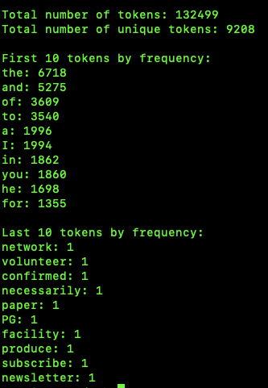
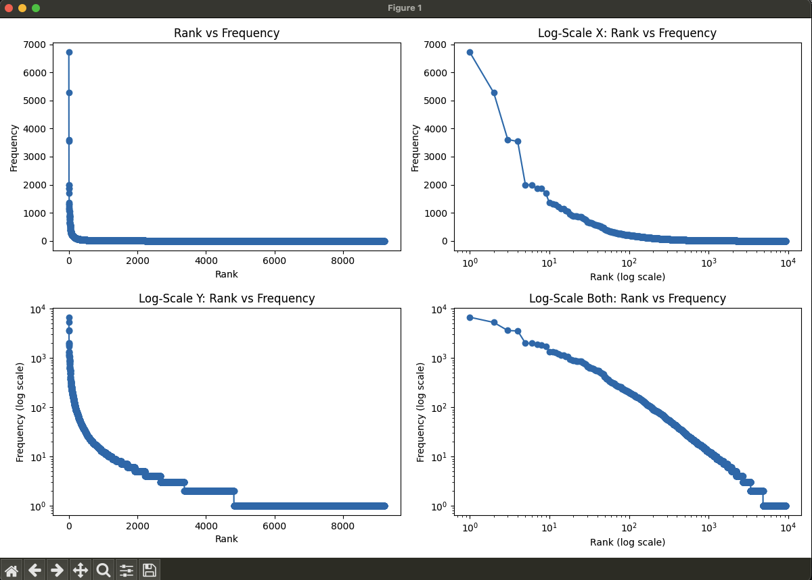
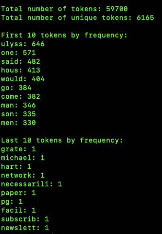
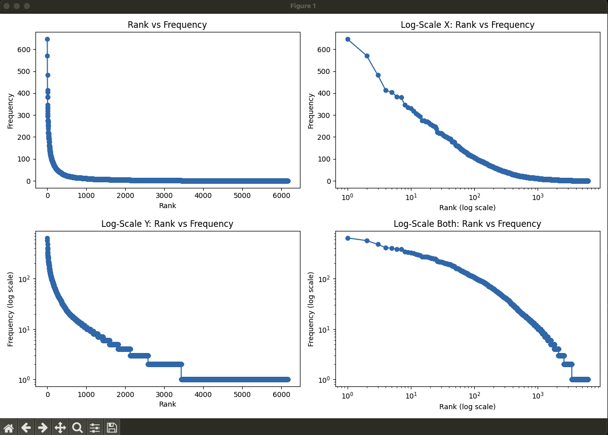

# Homework for 1/28/25
Ryan Smith
1/28/25
ARI 525 NLP
Homework 0, a basic NLP project

# Data

The file I selected is 'The Odyssey' from Project Gutenberg.  It is 718KB in file size.  The name is 'pg1727.txt'.  In general, I have never read this book.  I have read part of it now, and it sounds interesting.  I have heard of this book, and know it is very popular in English Literature, I believe.

# Methodogly

The approach I took to writing this software was to break it into components to start, based on our project pdf file.  I did this both for the python file, and the Homework Report file, along with the README also.  This is a good approach I believe, to get a good idea of the overall project and what you are doing.  I think it makes things come together better.

The options for the user:

- no_punctuation (additional option)
- expand_contractions (additional option; from 3rd party library 'contractions', 'pip3 install contractions')
- lowercase
- stopwords_removal
- stem
- lemma
- list_all (This will list all tokens sorted by frequency, most first (descending). The default stats are of just 10 of the most and 10 of the least.)

You can use just stem or lemma, but not both, since they don't work well together.  If you pass both options on the command-line, only one will work.  It checks for lemma first, so if you pass them both, only lemma will be processed.

As far as why the optional choices are useful features: No punctuation appeared to be very useful, and possibly was implied to be done.  Expand Contractions was also useful as it makes it more the intended word count, in my view.  Words such as 'isn't' become 'is' and 'not'.  I was surprised this was not in the NLTK library, but apparently the contractions library is fairly popular for this feature.

Some more commentary on code methodology:  I used a for iteration to go through the arguments passed on the command line.  I also just used sys from the python standard library and argv instead of potentially argparse or similar more advanced features, which I believed was not needed in this case.  I was going to break the project up into multiple files but decided to just go with one file since it seemed to work well.  If it was a larger project I would have probably broken it up into multiple files.

# Sample Output

## Sample Output 1
This sample output is of just --no_punctuation used.  This produces 132,499 total tokens and 9208 unique tokens.

Top 10 and last 10 for --no_punctuation only:

These top 10 words are mainly stopwords that are removed with --stopwords_removal, which is done in the next sample output, 'Sample Output 2'.

Plot for --no_punctuation only:

## Sample Output 2
This sample output is of all the options and stem instead of lemma.  This produces 59,700 total tokens and 6165 unique tokens.

Top 10 and last 10 for everything and using --stem:

Plot for everything and --stem:

These plots for Sample Output 2 are more balanced, not by a large amount though.  There is less of a rapid drop and flat-line appearance in some of them. They are overall more like the more balanced wikipedia article plots referenced in this homework assignment.  The number labels on the plots match the occurrences of each unique token, such as the number one of ulyss with 646 for the everything and --stem plots, along with ~6,000 total number of unique tokens.  Similar matching numbers for the Sample Output 1 data and plots which match, as a side note.

# Discussion

The discussion is broken into two parts.  The first part is of the questions from section 2.4.  Then a paragraph or two about what was learned.

## Part 1, From Section 2.4

### Question 1
What do you notice about the words at the top of your list?

They are of similar lengthy, is the first thing I see.  Most are between 3 and 5 letters.  The book is the Odyssey, and the top token is Ulyss, which is a normalized version of Ulysses.  Those are the main concepts of the top words.

### Question 2
Other than being “common words” do you notice any other kinds of properties they share?

Many of them are verbs also, such as:

- said
- go
- come
- went
- see
- tell
- make
- take

Those words listed above are all in the top 25.

Another thing that stands out is:

- ulyss
- man
- son
- men

Those four words above are in the top 25 also, and are all linked to males.  Father is another one a little bit down the list, but still actually even in the top 25.  God is in the top 25 also.

### Question 3
Now check the other end of your list: what do you notice about these words?

The words at the bottom of the list somewhat scrambled stemming based words.  Stemming produces some combinations that are not as coherent as lemmatization.  Stemming removes prefixes and suffixes and is simpler. Lemmatization is more advanced and uses a dictionary based approach.

### Question 4
After creating your figure(s), check out this wiki page, especially the introduction and the subsection entitle “Word frequencies in natural languages”. How do your results compare to the ones you see there?

The results are similar, but there is more balance in the figures on the wikipedia site related to Zipf's law.  The distribution spoken of is of a more stable balanced distribution also.  "It is usually found that the most common word occurs approximately twice as often as the next common one, three times as often as the third most common, and so on," according to the wikipedia article.  The other figures on the wikipedia site are of a larger number of words and sources, it looks like.  This is causing a more balanced appearing plot, along with the scaling used.  

My results are more on the extreme ends and less balanced, due partly to the single source of many frequently used words, with a lower vocabulary.  The x and y log scale does make them more like the wikipedia article plots, but they still are not as balanced.  Another concepts is the log scale makes subtle differences more discernable and helps to reveal patterns better.

Stopwords removal has the largest affect on the plots of my project.  When they are removed they are more balanced, and with them left the fast drop and flat line effect, to use that terminology description, are more prominent.

### Question 5
Why do you think that they are similar or different?

The main difference is of the larger amount of sources on the wikipedia page plots, with mine being just of 'The Odyssey'.  The log scale plots do help balance this, it seems, but not by a large amount though.  The removal of stopwords also helped with this.

### Question 6
What does this imply about the impact of removing stopwords like “the” on the total number of tokens in a corpus, compared to removing regular content words (e.g., nouns and verbs)?

The stopword removal causes a less balanced distribution of words, I believe.  With stopwords, there are considerably more tokens, of course also.  Removal of stopwords can have a minor impact on semantics of the sentences (meaning).  Removal of nouns and verbs makes the sentences not really understandable.  There is a major difference there. There are usually more nouns and verbs than stopwords, so removing stopwords will have a less effect on token count.

## Part 2 of Discussion

This homework assignment was a great learning experience.  This was the first time I worked with natural language processing in a more formal way, and before I only had very basic working with it.  I had never used the nltk, natural language tool kit before also.  I learned about the contractions library also for expand contractions which is a technique of normalization along with punctuation removal, stemming, lemmatization, lowercasing, and stopwords removal.  All of these topics were fairly new to me before this class started, and I had a minimal knowledge of them.  I enjoyed learning this topic also.  As far as unexpected problems, there weren't any really.  This homework assignment went very well with minimal issues.  I am looking forward to working on the next homework assignment.  Processing power wise, it seemed to use much less than machine learning.  All of the code ran very fast.  I was expecting possibly more processing time on a 150,000 token file.

# Chatbot Usage

I use chatbots such as ChatGPT as a reference mainly.  For example, to look up a concept.  An example concept could be 'What is normalization in NLP?'  Coding ways, I generally use basic lookups such as for a standard reference.  For example, 'What are the string methods for Python?'  Also, 'What are the parameters for python standard library str.split()'.   Another example for coding, 'Give me an example of str.split() in python.'  I will sometimes be more specific after an assignment is done, sometimes to just see a chatbots capabilities.  In general, I have had poor results with more specific instructions to chatbots.  Many times, to a surprising level, of chatbots making very blatant mistakes in more advanced instructions.
