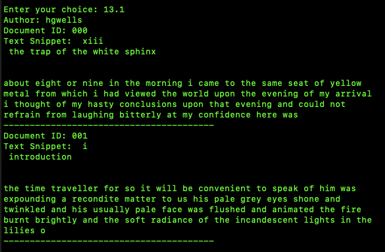
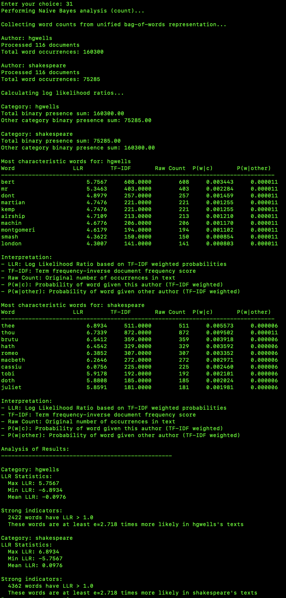

# Homework 1 Report

This is the Report of the second homework assignment, titled Homework 1.

ARI 525, NLP, Winter 2025
Homework 1 (second overall)
Ryan Smith
2/18/25

# Overview

I am using a menu system for this assignment.  main.py is the script to run, which includes all the other needed files.  After each selection of the menu, it will ask to press enter to continue.  This re-displays the menu.  It is driven by numbers, such as '10', or '11.1'.  you type in '11.1' and press enter, without the single quotes there which were used for emphasis.  It is in a number series of the steps described in the homework pdf.  Each step has various diagnostic functions also, which are listed in the menu system.  As far as a generative AI statement, I try to use it as a reference and dictionary, of sorts.  Both a reference in general on concepts, and a programming and library reference.  I try to be more on the vague side in prompts, not seeking direct solutions, but seeking to understand the concepts or how a library works programmatically.  

# Report

The report of the homework assignment.

## Dataset

The dataset I chose was books from Project Gutenberg from two authors.  The two authors are the two categories required.  A combination of their books totaled approximately 115 documents each.  These were all text files.

I split the books into chapters and scenes.  HG Wells was one of the authors, whose books were divided into chapters.  I used a shell script to split these.  I manually went through them also to remove chapters that were abnormally long or short, along with using some python code to identify this also which is one of the options from the menu.

The other author was Shakespeare, whose books or plays were divided into scenes.  Same thing was done for Shakespeare.

Here are the preprocessing / normalization steps I used:

1. Punctuation Removal
2. Lowercasing
3. Tokenization
4. Stopword Removal
5. Stemming or Lemmatization

I will go over these steps more in the Methodology section below.

### A Few Dataset Screenshots

Here are a few screenshots of some basic analysis of the dataset.  This is from code in the menu system, mainly from 11.1 Diagnostics on Dataset.  The second screenshot of sizes of the documents was used to remove 'outliers', too large or too small documents (chapters or sccenes).  The last two are of basic print outs of the first few documents from both datasets.


Character and String Sizes


Example of Two Documents from HG Wells


Example of Two Documents from Shakespeare


## Methodology

Here are details of the various methodologies of the steps of the assignment.

### Dataset

I am using a data sharing class for the variables and data structures.  It is called datasharing.py.  I include it in main.py.  It currently only contains corpus, which is a dictionary, with nested dictionaries mainly, and some lists.  I was thinking of making more data structures and variables, but ended up not needing to, so it just contains corpus.

```python
corpus = {
    "hgwells": {
        "001": {
            "text": "raw string value of file load",
			"filename": "the file name of the files",
			"size": "the size of the files",
			"punctuation_removed": "string with punctuation removed",
			"lowercased": "lowercased, includes previous steps",
			"tokens": [list, of, tokens],
			"stopwords_removed": [list, of, stopwords, removed, tokens],
			"stemmed_tokens": [list, of, stemmed, tokens, includes, previous, steps],
			"lemmatized_tokens": [list, of, lemmatized, tokens],			
			etc... Bag of Words, Naive Bayes, and some other steps contain some entries also, with these seen in the source code.
        }
    }
}
```

Above is the basic data structure, which is mainly nested dictionaries.  shakespeare is at the same level of hgwells, and is one of the two authors along with hgwells.  Documents range to about 115.  Each of the steps has a key value pair at the end.  Bag of words and some of the other steps have entries in the data structure as well.

#### Data Loading

This initial phase iterates over the text files and stores them in a dictionary hierarchy.

I hardcoded the directories and iterated through them loading the text files.

```python
author_dirs = {
        "hgwells": [
            "hgwells/pg35/chapters", "hgwells/pg36/chapters",
            "hgwells/pg159/chapters", "hgwells/pg718/chapters",
            "hgwells/pg780/chapters", "hgwells/pg5230/chapters"
        ],
        "shakespeare": [
            "shakespeare/pg1513/scenes", "shakespeare/pg1514/scenes",
            "shakespeare/pg1515/scenes", "shakespeare/pg1519/scenes",
            "shakespeare/pg1522/scenes", "shakespeare/pg1526/scenes",
            "shakespeare/pg1533/scenes"
        ]
    }
```

This gives about 115 documents each.

I kept track of filenames and sizes to analyze the dataset, with those described above as being a part of the corpus dictionary.

#### Punctuation Removal

A standard translator process was used, with a minor exception. The code snippet below is just pieces and isn't exact, as the third line that starts with 'doc_data' is a part of a for loop, and just listed below for example purpses.  The first line is of a requirement to remove single and double quotes, which apparently are called smart quotes that were in the text files.  The standard translator process would not remove them, so this was required.

```python
exclude_punctuation = set(string.punctuation) | {'\'', '"', '‘', '’', '“', '”'}

translation_table = str.maketrans('', '', ''.join(exclude_punctuation))

doc_data['punctuation_removed'] = doc_data['text'].translate(translation_table)
```

#### Lowercasing

A standard lowercasing process was used.  Basically just an iteration process and using .lower().

#### Tokenization

NLTK was used for tokenization, including the punkt_tab download. Pretty basic process of passing the lowercased string to word_tokenize from the NLTK library, and then saving the tokenized version as a list in the main corpus data structure hierarchy.

#### Stopword Removal

A standard stopword removal process was implemented using NLTK.  The NLTK download 'stopwords' was used, and an iterative process to check if words were in and or not in that stopwords list was used.  The result was saved as a list.  Each process builds on the prior one through the entire steps from data loading to topic modeling which was the last.

#### Stemming or Lemmatization

Standard stemming and lemmatization processes were used with the NLTK library.  I used stemming mainly for the entire pipeline, but lemmatization is used also.  The main differences between the two is of lemmatization being more advanced and produces more readable words.  NLTK wordnet was used for lemmatization.

#### Preprocessing Screenshots

Here are some screenshots from preprocessing diagnostics, which are available in the code and menu system.

Punctuation Removed (no punctuation in the screenshot (there was before))


Lowercasing (screenshot shows the previous image lowercased)



Tokenization


Stopword Removal (in the screenshots, removed words in the top 10 of 'the', 'of', 'or', 'about')


Stemming (notice the word, 7th one, morn. In lemmatization it is morning.)


Lemmatization


### Bag of Words

Bag of Words is essentially collecting the unique terms and assignment frequency of occurrence to them.  I have several functions here on analyzing them, including stats such as total terms, and average frequency for the author and individual documents, to list some of them.

I had some problems with Bag of Words working with Naive Bayes at first, until I made a second data structure with a unified author approach.  It worked better.  The indexing is unified in that approach, which is in the menu system and code of course.  I still have the separate indexing and various stats on that also.

#### A Few Bag of Words Screenshots

Per Document


Both Authors


Basic Structure


Unified (Both Authors)


### Naive Bayes

The options for computing probabilities were count data, binary, or tf-idf were all included. Two of these would be a part of the experimentation topic of the assignment.  The code change for these was minimal so I included all of them.

#### The Probabilities

#### Top 10 Words for Each Category

The top 10 words sorted by their log-likelihood ratios for each category.

Category 1, HG Wells Books

Category 2, Shakespeare Plays

#### A Screen Shot of Naive Bayes Analysis

Here is a basic screen shot of menu option 30.1 of a basic Naive Bayes analysis.  It is basically P(w|c) with it being word frequency divided by total words.


Here is a more advanced analysis screen shot from menu option 31.  LLR sorted top 10 words, with some other stats.



These comments are from menu option 31, Naive Bayes Analysis (count), although it is using weights.  The previous menu option uses just count.  I may have made this too complex for the assignment as a side note.  This course has been my introduction to formal NLP, with my having no real NLP experience before it.  The concepts have been confusing at first, but I have grasped them.  In making menu options 31, 32, and 33, I have tried to make some more advanced analysis, which often times became extremely confusing, and it might not have worked out completely right, although I think I have much of it right.

The detailed printout of a Naive Bayes analysis from 31.  Technically, the column 'P(w|c) is Naive Bayes on the word from the 'word' column.  LLR is Log Likelihood Ratio which is based on the next column of 'TF-IDF' weights.  The other one of 'P(w|other)' is doing a comparison with the other author.

Some comments on this.  We see the percentages drop considerably for the other author.  HG Wells and Shakespeare use considerably different words, and our data here is based on stemming, which is less coherent that lemmatization.  Lemmatization produces more sensical word tokens.  This is a factor in these stats.

Also, this is basing a standard Naive Bayes with a TF-IDF weighting.  Menu option 30.1 gives a simple Naive Bayes analysis.

LLR, log likelihood ratio, is taking P(w|c) and dividing it by P(w|other), and taking the log of that.  It is comparing the likelihood of a word for one author against it for another.  Here it is HG Wells and Shakespeare.  The positive value indicates more likelihood, negative less, and zero equal.  

There are similar ones for binary, and tf-idf, in the program.  Here is the menu numbers for them: 

- 30.1 Basic Naive Bayes (count)
- 31 Naive Bayes Analysis (count) (this is actually using some weighting)
- 32 Naive Bayes Analysis (binary)
- 33 Naive Bayes Analysis (tf-idf)

The main concepts of these is of raw frequency count for 'count', presence or not of the word for 'binary', and a weighted calculation for 'TF-IDF'.

TF-IDF considers not just the frequency of a word but also its relative rarity across the corpus, which helps to weight more important terms appropriately.

LLR = log(P(w|c) / P(w|other)) is essentially what LLR does, and with add-one smoothing, aka Laplace smoothing, it is just making sure words that don't appear have a value of one, as in they show as appearing at least once, even though they actually didn't.  This is a need when combining the authors with indexing.  If we are just working with one category (author) we wouldn't need this because all words are accounted for.  It is only needed when combing the authors, such as in the LLR implementation.

### Topic Modeling

Topic modeling was mainly of using gensim, and three topics were generated, 0, 1 and 2, which were then manually labeled by me.

Topic Modeling Table 1

| Topic # | Topic Label | Top Words (with Probabilities) |
|---------|-------------|--------------------------------|
| 0 | Formal Shakespearean Discourse | thou (0.012), shall (0.009), love (0.009), sir (0.009), thi (0.008), thee (0.007), good (0.007), well (0.006), ladi (0.006), let (0.006) |
| 1 | Narrative Action and Description | said (0.014), came (0.007), time (0.006), thing (0.005), littl (0.005), went (0.005), saw (0.005), face (0.004), could (0.004), door (0.004) |
| 2 | Casual Narrative and Dialogue | said (0.010), bert (0.007), thing (0.005), time (0.005), came (0.005), littl (0.004), could (0.004), seem (0.004), got (0.003), men (0.003) |

Author-Specific Topic Distribution

| Author | Top Topics | Topic Label | Probability |
|--------|------------|-------------|-------------|
| HG Wells | Topic 1 | Narrative Action and Description | 0.657 |
| HG Wells | Topic 2 | Casual Narrative and Dialogue | 0.339 |
| HG Wells | Topic 0 | Formal Shakespearean Discourse | 0.003 |
| Shakespeare | Topic 0 | Formal Shakespearean Discourse | 0.991 |
| Shakespeare | Topic 1 | Narrative Action and Description | 0.009 |
| Shakespeare | Topic 2 | Casual Narrative and Dialogue | 0.000 |


This table is of the three topics generated, along with ten words and their probabilities for each topic, then per author the top five words and their probabilities.  This is in relation to their probability of occurring in each of the categories (authors).  Below is an actual screenshot of the results also.  Also, these labels were the best I could come up with, and might not be the most accurate technically, as I am not an expert in Shakespeare or HG Wells, or writing in general.


### Experimentation

#### Experimentation with Normalization

The main normalization option in my view would be that of stemming or lemmatization.  Lemmatization results in more sensical words, and it is more complex than stemming, so that is not a surprise.  I have two branches on this.  Very similar results except for the clarity of words advantage with lemmatization.

#### Probabilities with All Three Options

Here are the probabilities with all three options given: count data, binary, and tf-idf.  Count uses raw count numbers, binary uses if there is a value or not, and tf-idf is a weighted method, and equation based method.  Some related concepts are the raw count method will emphasize heavily used words.  The binary method will be more balanced across the documents and in general.  The tf-idf will be weighted and incorporates documents into the process of the calculation.

My Naive Bayes section covers all three of these.  The code difference for the three was minimal, so it was fairly easy to implement.

## Results and Analysis

Here are the parts that request results and analysis.  Some may have already been give in the methodology section, but this was a section in the assignment pdf.  Some overlap might take place here and the previous methodology section.

### Topic Identification

Results and Analysis Table 1

| Topic # | Topic Label | Top Words (with Probabilities) |
|---------|-------------|--------------------------------|
| 0 | Formal Shakespearean Discourse | thou (0.012), shall (0.009), love (0.009), sir (0.009), thi (0.008), thee (0.007), good (0.007), well (0.006), ladi (0.006), let (0.006) |
| 1 | Narrative Action and Description | said (0.014), came (0.007), time (0.006), thing (0.005), littl (0.005), went (0.005), saw (0.005), face (0.004), could (0.004), door (0.004) |
| 2 | Casual Narrative and Dialogue | said (0.010), bert (0.007), thing (0.005), time (0.005), came (0.005), littl (0.004), could (0.004), seem (0.004), got (0.003), men (0.003) |

### Author-Specific Topic Distribution

| Author | Top Topics | Topic Label | Probability |
|--------|------------|-------------|-------------|
| HG Wells | Topic 1 | Narrative Action and Description | 0.657 |
| HG Wells | Topic 2 | Casual Narrative and Dialogue | 0.339 |
| HG Wells | Topic 0 | Formal Shakespearean Discourse | 0.003 |
| Shakespeare | Topic 0 | Formal Shakespearean Discourse | 0.991 |
| Shakespeare | Topic 1 | Narrative Action and Description | 0.009 |
| Shakespeare | Topic 2 | Casual Narrative and Dialogue | 0.000 |


## Discussion

### Section 1

This assignment was about a process that included topics such as preprocessing and normalizing an NLP dataset, including more advanced topics of Bag of Words, Naive Bayes probabilities, and Topic Modeling.  The main steps were:

1. Data Loading
2. Punctuation Removal
3. Lowercasing
4. Tokenization
5. Stopword Removal
6. Stemming or Lemmatization

Those were the preprocessing and normalization steps.

Then we went on to

1. Bag of Words
2. Naive Bayes probabilities
3. Topic Modeling

Punctuation removal is pretty straight forward, it was removing the punctuation.  Lowercasing was similar.  Tokenization is taking a string, in our case twice modified, and putting it into list format as 'tokens' for easier processing.  Then we removed the stopwords, which are basic words such as 'the' and 'and', etc.  Stemming and lemmatization are very similar in that they reduce words to their base forms, but lemmatization is more accurate and more complex.  It results in more readable words.

Bag of Words is putting the tokens into a matrix with the main concepts being of their frequencies. You have all the unique words and their frequency of usage, is the main concept.  Naive Bayes probabilities is of finding probabilities of words occurring in either of the categories, which was authors in this case.  HG Wells and Shakespeare.  Topic modeling is of having an algorithm and model find topic patterns, based on word groups.  I used Gensim, a popular library for this.  It groups topics by word groupings that it sees are related.  I then manually labeled those topics. It gives some stats based on this also. 

### Section 2

This was a great assignment.  I put a surprisingly large amount of time into it, and it payed off I believe.  I learned a lot from this assignment.  Single and double quotes can be from another character set not recognized by the standard string translator of python, and requires some manually work to remove them, to name one somewhat interesting concept.  I had almost no knowledge of NLP going into this course.  This has all been very new to me. This lesson had it all coming together finally, and making sense.  I had never heard of gensim, the python library before also.  Fairly easy to use though, no real problems.  

One of the main things on the assignment is that I built the data structure from the beginning.  I sat down and really thought about how to put this into a model format.  The data structure I ended up using, corpus which was a dictionary, with nested dictionaries and some other types, worked great.  I didn't really need any other data structures.  It made the project go smoother also, I believe.  It helped me learn how the concepts worked more also, such as Bag of Words.

Towards the end of this assignment I felt i really understood the core concepts.

1. Preprocessing / Normalization
- Punctuation Removal
- Lowercasing
- Tokenization (list element form, or space separated string)
- Stopword Removal (common word removal)
- Stemming or Lemmatization (Stemming simpler)

2. Bag of Words (Frequency counts of words basically)
3. Naive Bayes (Naive (aka simple) method of calculating probabilities: per word frequency divided by total words)
4. Topic Modeling (Topics are groups of words that appear together often, along with manually labeling these; we check the probabilities of these topics occurring in a category (our authors here))

Those are the main concepts, which really make sense when viewed as the overall process of analyzing a corpus.  That is a simple list and analysis above, but captures the main concepts.  A few more details: Naive Bayes of the simple "Naive" component of P(w|c), then LLR Log Likelihood Ratio which compares this with the category of another author, and puts it in log form, is the main concept with it.  This was good for comparison purposes, and was confusing at first to implement, but I figured it out.