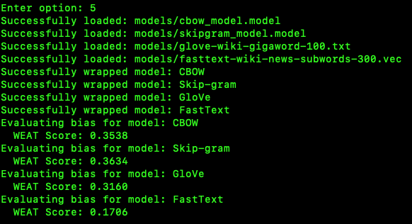
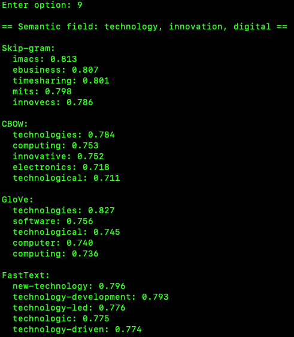
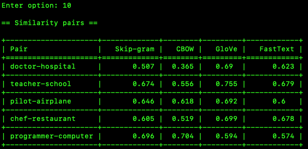

<!-- readme for homework 3 -->

# Homework 2 (3rd Homework Assignment) README

The file to run is `main.py` which contains a menu system that runs each step of the homework.

# Files

- `main.py`: The main file to run
- `dataset.py`: Contains the dataset and preprocessing
- `training.py`: Contains the training
- `comparison.py`: Contains the comparing steps
- `bias.py`: Contains the bias steps
- `classification.py`: Contains the classification steps

- `REPORT.md`: The report for the homework
- `README.md`: This file

# Walkthrough

Below is a walkthrough of the menu system and app in general.  If a stage has not been run yet it will run and save the results.  If it has run then it will load the results from the saved file.  It also saves some of the reports to text files or image files in various directories.

## The Main Menu


## 1. Load Dataset


Here the dataset is loaded and an example is printed.  This is the first entry of the wikipedia simple dataset.  The results are dictionaries.  Here you can see the key value pairs.  The main content of the article is in the 'text' key.

## 2. Preprocess Dataset


Various preprocessing is done.

```python
# here is the main preprocessing code
```

## 3. Train Model


Here the two models are trained.  We train the wikipedia dataset with skip-gram and CBoW.

## 4. Compare Models


This stage has the linked menu options of 7 to 11.  Those display based menu options will display the results from here.  The print statement also states they are stored in the comparison_results directory.

The menu options for these:

7. Display most similar words
8. Display vector arithmetic results
9. Display semantic field results
10. Display word similarity results
11. Display analogy results

## 5. Evaluate Bias



Here is the bias evaluation.  This image above is of the first part of the bias results.  These results are not being stored also, but most other results in this project are.  I could have added that but just didn't get to it, and feel this print out is sufficient.  The REPORT.md covers the other sections of this bias results. 

## 6. Classify Text


Here is the beginning of the classification process.  There are more results shown, including the other model which is the CBoW FastText model.

## 7. Display Most Similar Words


Menu options 7 to 11 are linked to the comparison results.  This is the first of those results.  This is of the five queries that are run on the four models.  The trained wikipedia simple dataset with the CBoW and skip-gram models, and the pretrained FastText model along with the other pretrained GloVe model.

## 8. Display Vector Arithmetic Results


Vector Arithmetic Results.  Cocnepts such as 'word' +'word2' - 'word3' = 'word4' are tested.  The results are shown here.

## 9. Display Semantic Field Results



Semantic Field Results.  Here the results are shown for the semantic field.  The semantic field is the words that are most similar to a given word.  This is similar to the most similar words, but this uses a list and the most similar words uses a single word, is the main difference.

## 10. Display Word Similarity Results



Word Similarity results.

## 11. Display Analogy Results


Analogy results.

## 12. Exit

# The Results
