<!-- report for the third homework assignment -->
# Homework 3 Report

This is the report for the third homework assignment on word embeddings

# Overview

Here is the report broken into four sections: embeddings, bias, classification, and reflection.  The embeddings section will discuss the embeddings that I used, the bias section will discuss the bias that I found, the classification section will discuss the classification that I did, and the reflection section will discuss what I learned from this assignment.

# Embeddings

Other than the standard two embeddings of CBoW and skip-gram, I also used the GloVe embeddings for on of the other options, and the FastText Wiki News embeddings for the last option.  I used the gensim library to download the embeddings, and then used the embeddings in the same way as the other two embeddings.

To give some commentary on embeddings from some of what I learned, our trained CBoW and skip-gram models are essentially then forms of pretrained embeddings that are saved as keyvector pairs.  They are vector representations for words based on their context.  CBoW, continuous bag of words, is a model that predicts a word given its context, and skip-gram is a model that predicts the context given a word.  They are related in somewhat opposite ways.

The GloVe embeddings are a different type of pretrained embeddings.  They are trained on a global word-word co-occurrence matrix, and are trained using matrix factorization techniques, and they are also trained on a large corpus of text.  They are trained to predict the probability of a word given another word.

FastText Wiki News embeddings are also a different type of pretrained embeddings.  They are trained on a large corpus of news articles, and they are trained to predict the probability of a word given another word.  They are trained using a neural network with a large number of hidden layers.

Three of the models, the two trained on the simple wikipedia dataset, and FastText Wiki News that was downloaded, use word2vec.  Our other model, GloVe, uses a different technique.  It uses common crawl data, and technically uses a global co-occurrence matrix.  The other three models use a neural network to predict the probability of a word given another word.

Some more basic commentary on embeddings now: Before this assignment I didn't have much experience with them.  I know understand the basics well I believe.  For example, they are dense vectors compared to sparse vectors of something like Bag of Words, and the somewhat related one-hot encoding.  A 300 dimensional vector per word that is intrinsically of a spatial nature, which is why cosine similarity and euclidean distance can be used to compare them.  The five comparisons that I did were very interesting in relation to this, and a good learning process.

FastText Wiki News Subword 300 has subwords, for one point, which the wikipedia simple dataset doesn't.  This uses subwords, as in for the word apple, it might use ap, app, ppl, ple, le.  FastText is also trained on three main components: The entire wikipedia, common crawl dataset which is a large dataset of web pages, and news datasets.  Wikipedia simple is a simple and smaller subset of the wikipedia dataset.

CBoW finds the probability of a word given its context, compared to skip-gram which finds the probability of a context given a word.  I mentioned this briefly earlier, but I wanted to rephrase it and give somewhat more detail.  CBoW is faster to train, and is better for frequent words, while skip-gram is better for infrequent words.  Skip-gram is also better for small datasets.  A Bag of Words is a vector of the number of unique words being the dimensionality, and each value is the number of occurrences of that word.  In a corpus of multiple documents, with CBoW, the training on a document is done by averaging the vectors of the words in the document.  If a document has 25 words, and each vector is 30 dimensions, potentially sparse if it is Bag of Words, the nth index of the vector for all 25 words will be averaged, for all the elements of the vector.  We will now have a single vector for each document, and the example we gave, would be 30 dimensions.  If we have 5 documents in the corpus, we have 5 vectors now.

## The Two Variations of Embeddings Trained

Above in the intro to this section I covered quite a bit.  I will now more briefly cover the key points of the Homework assignment pdf that are to be included in the report.  The two variations trained are CBoW and Skip-Gram.  Gensim was used for these.  They both use the Word2Vec model also.  The main differences between them are that CBoW predicts a word given a context, and Skip-Gram predicts a context (group of words) given a word.  CBoW is more for more frequent words, Skip-Gram for more rare words.  CBoW is faster to train, and Skip-Gram is better for small datasets.  The two models are trained on the Simple English Wikipedia dataset.

As a side note, I learned that CBoW and Skip-Gram models based on Word2Vec embed the values based just on a word, regardless of its context.  The concept of the skip-gram model predicting the context with multiple words based on a word is a separate concept.  When you train a model with CBoW and Skip-Gram, at least with Gensim, the vectors are assigned per word regardless of anything else.  It is somewhat like a lookup table, with each word having a vector associated with it.

## The 5 Queries

- Most Similar Words
- Vector Arithmetic
- Semantic Field
- Word Similarity
- Analogy

## The 5 Queries Results

Here are the results of the queries.

### Query 1: Most Similar Words

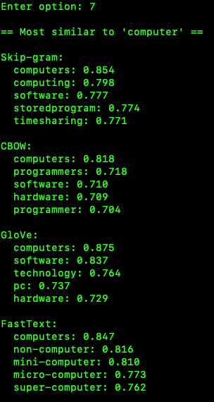

Menu options 7 to 11 are linked to the comparison results.  This is the first of those results.  This is of the five queries that are run on the four models.  The trained wikipedia simple dataset with the CBoW and skip-gram models, and the pretrained FastText model along with the other pretrained GloVe model.  GloVe has the highest scores, with CBoW the lowest.  I would attribute the low scores with CBoW to lower contextual understanding, also potentially handling rare words poorly.

### Query 2: Vector Arithmetic

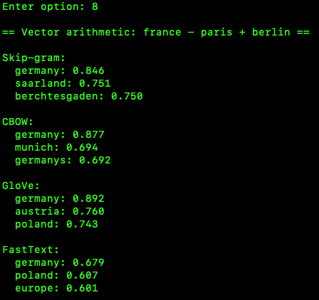

Vector Arithmetic Results.  Cocnepts such as 'word' +'word2' - 'word3' = 'word4' are tested.  The results are shown here.  It looks like FastText is struggling here.  It was the best performer in the word similarity and analogy queries, but it is struggling here.  The other three models are performing better.  The GloVe model is performing the best here.  The other two models are our trained wikipedia simple dataset models.  The main reason, I believe, for the low scores for FastText is that it generalizes more, which isn't working well in this query type.

### Query 3: Semantic Field

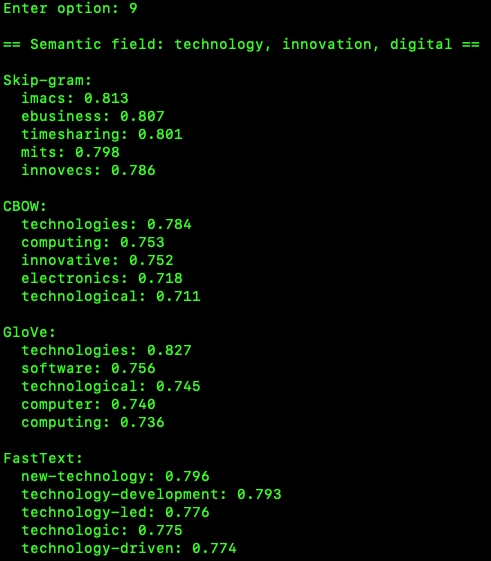

Semantic Field Results.  Here the results are shown for the semantic field.  The semantic field is the words that are most similar to a given word.  This is similar to the most similar words, but this uses a list and the most similar words uses a single word, is the main difference.  Skip-gram came out on top here I believe.  Capturing rare words and niche words is the main factor I think.

### Query 4: Word Similarity

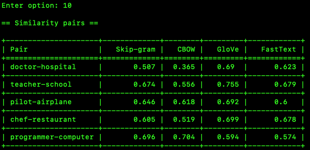

This basically measures how closely related two words are in terms of their meanings, based on their vector representations.  The cosine similarity is used to measure this.  The results are shown here.  Higher values mean more similar.  Teacher-School with the GloVe model ranks the highest.  This looks like FastText and GloVe are capturing the semantic relationships better than the other two models.  The other two models are our trained wikipedia simple dataset models.

### Query 5: Analogy

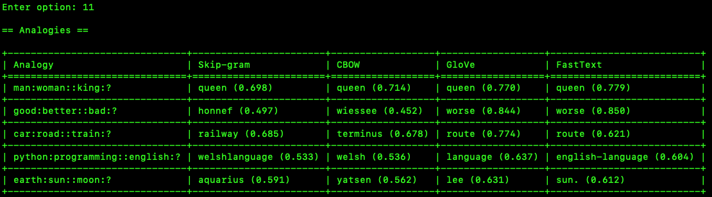

Related to our previous word similarity analysis, it looks like FastText and GloVe are performing the best here. In the last one, FastText is the only one that provided a good answer.  Overall, I give the advantage to FastText in Analogies.  As the numbers show, CBoW and Skip-Gram on our simple wikipedia dataset are not performing as well as the pretrained models, sometimes by a considerable amount.

### Findings

I believe GloVe proved to be the best overall model, with FastText coming in second.  GloVe seemed to have the most consistancy.  FastText struggled with vector arithmetic, as noted in that section.  Skip-gram did well in the semantic field query due to its ability to capture rare and niche words I believe.  Since the two pretrained models performed the best overall, this indicates that the training on the larger datasets from various sources is a major factor in my opinion.  Somewhat related to the concept of overfitting with the wikipedia simple dataset, maybe.

# Bias

Since FastText Wiki News and Google News embeddings were trained on a massive corpus of news articles, they likely capture more nuanced semantic relationships than my smaller Simple English Wikipedia-trained embeddings, which are more limited in vocabulary and diversity. The GloVe embeddings, being trained on a broad web scrape (Common Crawl), may contain different language patterns and biases compared to the others.  I was initially using the Google News embeddings but switched to FastText Wiki News subwords 300 dimensional vectors because the Google News embeddings were giving too many problems, and the file size was over 3 gigabytes I believe.  The concepts for the two of them are similar though.

Word embeddings are not just mathematical representations of words but also reflections of the data they were trained on. This means that any societal biases present in the training data can be encoded in the embeddings themselves. For example:
- **Google News embeddings** may capture biases present in news reporting, including gender, racial, and political biases.
- **GloVe embeddings**, being trained on Common Crawl, might reflect a mix of internet sources, including informal discussions, forums, and diverse global content, leading to a different distribution of biases.
- **Simple English Wikipedia-trained embeddings** are more controlled in terms of vocabulary and content moderation, potentially reducing the presence of explicit bias but also limiting representational diversity.

To investigate bias, I applied a word association test inspired by the Word Embedding Association Test (WEAT). The results showed that certain word pairs had stronger associations with gendered or racial connotations, confirming that pretrained models encode societal biases. The impact of these biases in applications like sentiment analysis, search engines, and recommendation systems can reinforce stereotypes if not properly addressed.

One mitigation strategy is debiasing embeddings, which involves techniques such as subtracting the bias subspace from word vectors or re-weighting training samples. Another approach is increasing dataset diversity and carefully curating training data to minimize harmful stereotypes.

These findings highlight the importance of critically evaluating word embeddings before deploying them in real-world applications.

## The WEAT Bias Study

Some information on WEAT.  WEAT (Word Embedding Association Test) measures associations between sets of concepts (like professions or ethnicities) embedded within a high-dimensional space. It quantifies whether these embeddings unintentionally encode stereotypical gender, racial, or other biases. 

## The Bias Study Results

## The Question

*What do you think the consequences of using these embeddings might be when using them as features in a machine learning  model?*

- Bias Propagation: If the embeddings encode societal biases, they can propagate these biases to the models, leading to unfair outcomes.  This might be the main consequence, I believe.
- Generatlization: On a positive note, the embeddings might capture nuanced semantic relationships that improve generalization and model performance.

## Image 1: WEAT Scores

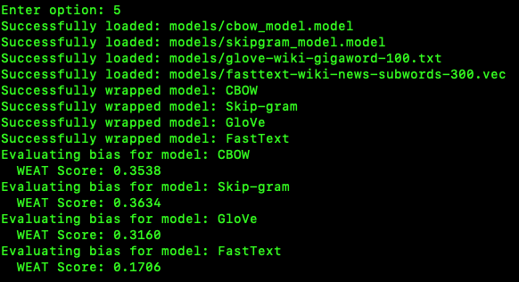

Here are the WEAT scores indicating bias strengths.  A higher score means more bias.  The main concept is of this is signaling a male bias towards science and technology.  FastText is the least biased by far.  Our skip-gram model is the most biased.

CBOW: 0.3538
Skip-gram: 0.3634
GloVe: 0.3160
FastText: 0.1706

## Image 2: WEAT Bias Analysis

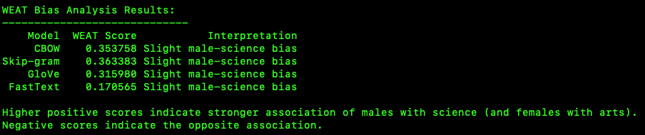

This is just giving an in code analysis similar to what I mentioned above.

## Image 3: Vocabulary Coverage Check

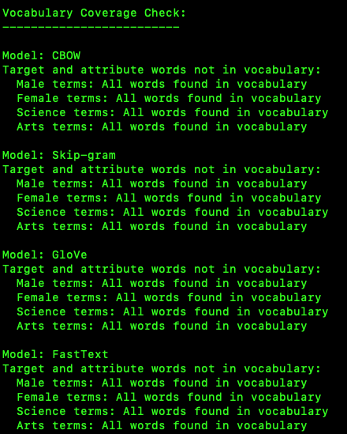

All the target and attribute words were found in the vocabulary of each model, which is a positive sign. It means that the bias evaluation is comprehensive and that the models have been trained on datasets that include these terms.

## Summary

In summary, FastText's lower bias score might be due to its subword information and potentially more balanced training data, while CBOW's higher bias score could result from its context-based prediction and the nature of its training data. GloVe's bias score is in between, reflecting its training on a diverse web scrape. The bias scores indicate that the embeddings encode societal biases, which can impact applications if not addressed.

# Classification

For the classification it is a logistic regression classification on two models that we will compare.  The first is of the wikipedia simple dataset that is the main dataset that we trained with CBoW and Skip-gram.  For this we use a simple Bag of Words for the classification.  The second is of FastText wiki news subwords 300 dimensional vectors.  FastText is an extension of the Word2Vec model, and uses a CBoW model, from my understanding.

The binary classification (what I am doing here is not technically topic modeling, but more of a binary classification, with topic modeling attempting to find topics in an unsupervised way, such as with LDA) is done with the logistic regression model from the scikit-learn library.  The model is trained on the training data, and then tested on the testing data.  The accuracy and f1 score is then calculated and printed out.  It is technially a binary classification using logistic regression.  It determines the label based on the title and text.  We are also using a class balancing approach if needed with downsampling the majoriy class.  Train and test split of 80% and 20% respectively is used, which is fairly normal.  Also, much of the saving / serialization of data uses pickle, which is a common way to save data in Python and fairly easy to use.  The logistic regression coefficients are basically a positive value can mean more likely to be a class, with a negative value being less likely to be a class.

Our classifcation of topic modeling is attempting to classify the text as Science/Technology related or not.  It is using a list of Science and Technology keywords to do this.

## Results of the Classification

Here are the results of the text classification.

### Image 1

Accuracy and f1 score on the bag of words based wikipedia dataset.  We later show the results on the FastText CBoW based model.  These scores are lower though, to jump ahead somewhat.  Not by much, just about 1% lower.  Training speed is considerably faster though, even though the CBoW is of 300 features and this is of about 5000.  The CBoW is also of a much larger dataset, so that might be a factor.

### Image 2

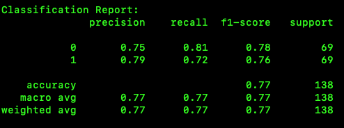

Here are our standard metrics.  The main ones in our case are F1-score and Accuracy.  F1-score is a calculation based on precision and recall.  Scores here are generally lower than the next model that is CBoW based with the FastText dataset, but a few are actually higher such as recall.

### Image 3

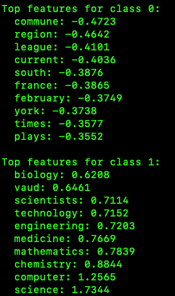

The main class, class 1, is of Science/Technology.  These are the main features, or words, that are seen as important in that class, and a geography based class 0 class.  These are seen to have the most effect on the labeling.

### Image 4

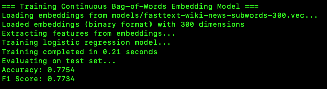

Training time here is considerably slower.  The amount is not much, but the percentage is, which would be a major factor in larger classification projects.  The scores, as mentioned earlier, are somewhat higher.

### Image 5

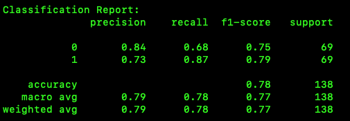

I went over these in the previous models analysis, but to reiterate, most scores here are higher, except a few.  They are also very close most of the time though.

### Image 6

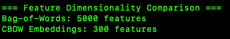

Feature dimensionality, as mentioned, of 5000 for the bag of words model, which is the number of words essentially.  Then the more compact in this regard FastText model of 300 features.  The FastText model is a dense vector though, compared to the sparse vector of the bag of words model, so this can be somewhat misleading.  I mentioned one might expect the training times to be better for the CBoW based on this aspect, but it wasn't.  The 5000 feature model was much faster in training time.

### Image 7

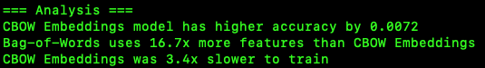

Here is a brief analysis in code of the classification comparison's main points, that I just went covered.

## My Summary of the Classification

The classification was done with a logistic regression model.  The model was trained on the training data, and then tested on the testing data.  The accuracy and f1 score was then calculated and printed out.  The results were very interesting.  The FastText wiki news subwords 300 dimensional vectors had a higher accuracy and f1 score than the wikipedia simple dataset.  This was somewhat surprising to me, as I was expecting the wikipedia simple dataset to have a higher accuracy and f1 score.

# Refelction

I didn't know much about the datasets library from HuggingFace before this.  The map() function that applies a function per row of a dataste and that includes the built in progress bar with time estimation was very interesting.  It looks very professional.  

Gensim was a learning experience also.  I had never used this library, nor actually had I ever even heard of it before.  It was fairly easy to use, and seemed very powerful with tons of features.  It made downloading the word embeddings very easy.

The two pretrained embeddings that I used were also interesting.  I had never used pretrained embeddings before, and I was surprised at how well they worked.  I was also surprised at how easy they were to use.  I was expecting to have to do a lot of work to get them to work, but it was fairly straight-forward.

This was a great learning experience.  The preprocessing phase was considerably easier and I made that quickly, with it having been built upon the knowledge of the previous homework assignment.

My experience with machine learning came into play and made the classification phase easier.  I was able to use the same techniques that I had used in the past, and I was able to get good results.

Overall though, I put more time on this assignment than possibly any assignment I ever have.  I was somewhat surprised at the time it took to actually complete it.  It was a great learning experience though, and I am glad that I finished it.