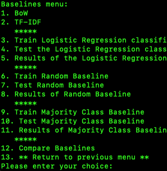

# README

This is for the SMS Spam Detection assignment.

# Python Version

I used Python 3.11.9 for this.  All the required packages installable by pip were up to date.

# Files

- main.py
- README.md
- REPORT.md
- dataset.py
- fine_tune.py
- zero_shot.py
- baselines.py

The screenshots directory contains screenshots of the walkthrough in this README.md file towards the end.

# How to Run the App

```
./main.py
```

This will bring up the main menu, which allows you to navigate through the app.

# Walkthrough

A brief walkthrough with screenshots.  This is not intended to be very descriptive, but give an example of the menu options and results.  The details and explanations are in the report.

## Main Menu


The main menu is the entry point of the application. It provides options to load the dataset, fine-tune models, perform zero-shot classification, and evaluate baselines. The user can select an option by entering the corresponding number.  '6.' here will exit the app.  If you go to one of the other options, you can return to the main menu by entering a corresponding number which is always the last one in the sub-menu.  There is only two menu levels except for one third, which is in baselines.  This is of the standard BoW and a combined BoW TF-IDF LR model.

## Dataset

This is the dataset menu, which contains three choices of load the dataset, verify it, and return the previous menu.  Here in the screenshot below we have already loaded the dataset, and we select option 2 of verify it.


There are some basic printouts of information on the dataset that was loaded, which was the SMS Spam detection dataset.  The dataset is split 80/20, and shows 4459 total samples in the train set, and 1115 in the test set.  Number of classes is 2, which are 0 = ham and 1 = spam.  Class distribution shows an imbalance of the majority class is ham.  It is about 86% approximately.  The dataset column with the message is 'sms' not 'text' as in some datasets.  There are two samples shown in the screenshot above also.

## Fine-tuning

Here we have the fine-tuning menu below:


We can fine-tune DistilBERT and T5 here, along with test them, then display the results, along with a final compare of both of them with option 7.


Above are the results from fine-tuning DistilBERT.


Above are the results from fine-tuning T5.


Above are the results from comparing both models.

## Zero-shot Classification

Here we have the zero-shot classification menu below:


Below is the best prompt for ExaOne finishing, which is the fifth one of five.


Below is the results.  This looks like the above screenshot, but is somewhat different.  This is the actual results with the best prompt listed, with the above screenshot was that best prompt finishing.


Below is the best prompt for Granite, which is the second one of the five.


Below is the results for Granite.


Below is the results for the comparison of both ExaOne and Granite.


## Baselines

Baselines menu is below:



Baselines comparison is below:


## Baselines - Extras

Here are the extras for the baselines.  The first one is the standard BoW model, which is a simple bag of words model.  Then we have the combined BoW TF-IDF LR model, which is a logistic regression model that combines both bag of words and TF-IDF features.  The results are shown below.


Below are the results for the comparisons.


This was intended to be a brief and basic walkthrough, with the details and explanations being in the report.